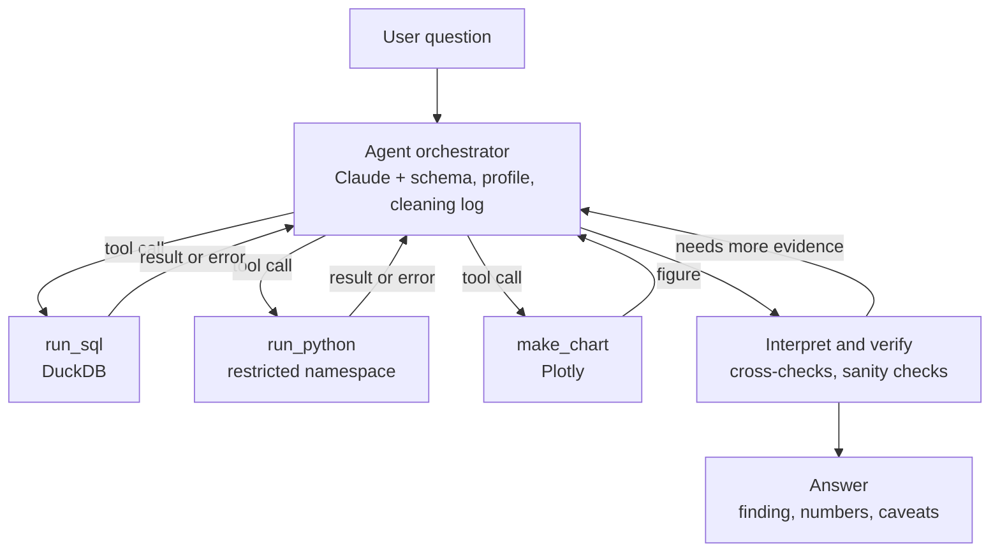

# AI Data Analyst Agent

**Live demo:** [ai-data-analyst-derleensaini.streamlit.app](https://ai-data-analyst-derleensaini.streamlit.app/)

A Streamlit app where you upload a CSV, ask questions in plain English, and get
answers backed by real SQL queries, Python analysis, and charts instead of the
model's guesswork. An agent loop decides which tools to use, checks its own
results, and writes up findings the way a careful analyst would, with
assumptions and caveats stated. I built it with Claude Code, working phase by
phase from a written spec ([CLAUDE.md](CLAUDE.md)), and it had to pass an eval
before I called it done.

## Architecture



The agent receives the question along with the dataset's schema, an automatic
data profile, and the cleaning log. Each tool call is executed and the result
or the error message is fed back to the model, which keeps iterating until it
returns a final text answer. Failed queries get the error and up to **2
retries**; a hard cap of **8 tool calls per question** prevents runaway loops.

## Analyst behavior

- **Automatic profiling on upload:** nulls, duplicates, type problems, outliers
  (IQR), near-duplicate category labels, impossible dates.
- **Interactive cleaning panel:** safe fixes (whitespace, null placeholders,
  type parsing, exact duplicates) apply automatically. Judgment calls like
  merging labels, imputing, dropping rows, or treating outliers require a
  click. Every action is logged and undoable, and the raw data is never
  modified.
- **Outliers get diagnosed before they get treated:** data entry error, unit
  mistake, or legitimate extreme. Legitimate extremes are reported, not
  deleted.
- **Answers state assumptions and caveats:** ambiguous questions get an explicit
  definition, and small samples and incomplete periods get flagged.
- **Grounding rule:** any specific number or ranking in an answer must come
  from a tool call made for that answer (or the deterministic data profile),
  never from model memory.

## Evaluation

I tested the agent against 11 hand-verified questions on the Sephora
product dataset (8,494 products). I computed every answer myself
first, so the answer key is independent of the agent. The set covers
simple lookups, aggregations, a statistical comparison, two trick
questions the data cannot answer (correct behavior is saying so),
and one ambiguous question where the agent must state which
definition it used.

A script (tests/run_eval.py) runs all 11 questions through the agent
and records its answers, tool calls, and loop turns. I graded every
answer by hand against my verified key.

| Version | Score |
|---|---|
| Initial agent | 10.5/11 |
| + grounding rule (numbers must come from a tool call) | 10.5/11 |
| + ranking clause (no claims about rankings it didn't run) | 11/11 |

The eval earned its keep twice. The first run caught the agent
asserting a specific review count it never queried, in a side remark
attached to an otherwise correct answer. I added a grounding rule
requiring every stated number to come from a tool call made in that
answer. The rerun showed the rule fixed the numbers but not the
claim: the agent stopped inventing figures but still asserted which
product "would lead" a ranking it hadn't run, and it was wrong. A
second clause closed that gap, and the final run passed 11/11
cleanly.

I later ran the same eval on Claude Sonnet 5: it also scored 11/11
(see tests/model_comparison.md), so the app deploys Sonnet for speed
and cost.

The question set and full results are in tests/.

## Running locally

```bash
git clone https://github.com/derleensaini/ai-data-analyst.git
cd data-analyst-agent
pip install -r requirements.txt
echo "ANTHROPIC_API_KEY=sk-ant-..." > .env
streamlit run app.py
```

No CSV handy? Pick **Sample dataset** in the app. The Sephora product catalog
(8,494 products) and a unicorn companies dataset are built in, each with
suggested questions to try.

## Limitations

- `run_python` uses namespace restriction (no imports beyond an allowlist, no
  file or network builtins, output caps). That is fine for a single-user local
  tool but it is not a security boundary. A multi-user deployment would need
  process isolation with timeouts.
- Undo rebuilds the working data from the raw file plus an action log on every
  change. I chose correctness over speed here, which is the right trade at
  these file sizes.

## Tech stack

- Python · Streamlit · pandas
- DuckDB (SQL over dataframes)
- Plotly (charts)
- Anthropic API (Claude, tool use)
